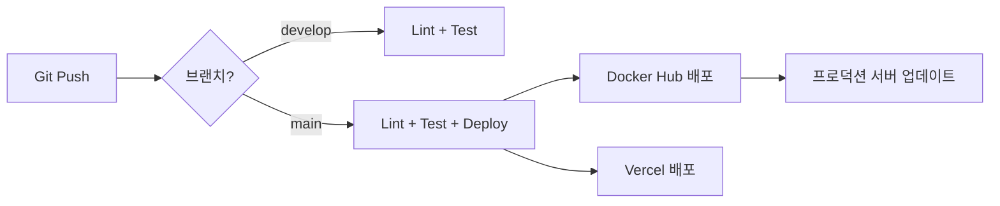

# BAIKAL Shorts Engine - CI/CD 설정 가이드

## 📋 목차
1. [GitHub Actions 워크플로우 개요](#github-actions-워크플로우-개요)
2. [필수 GitHub Secrets 설정](#필수-github-secrets-설정)
3. [Docker Hub 설정](#docker-hub-설정)
4. [Vercel 배포 설정](#vercel-배포-설정)
5. [로컬에서 CI 테스트](#로컬에서-ci-테스트)

---

## GitHub Actions 워크플로우 개요

### 1. Backend CI/CD (`.github/workflows/backend.yml`)
- **트리거**: `backend/` 폴더 변경 시
- **단계**:
  - **Lint**: Black, Flake8, MyPy로 코드 품질 검사
  - **Test**: Pytest로 단위 테스트 및 커버리지 측정
  - **Docker**: main 브랜치에 푸시 시 Docker 이미지 빌드 및 배포

### 2. Frontend CI/CD (`.github/workflows/frontend.yml`)
- **트리거**: `frontend/` 폴더 변경 시
- **단계**:
  - **Lint**: ESLint로 코드 스타일 검사
  - **Build**: Vite로 프로덕션 빌드
  - **Deploy**: Vercel에 자동 배포 (main 브랜치)
  - **Docker**: Docker 이미지 빌드 및 배포 (선택 사항)

### 3. E2E Tests (`.github/workflows/e2e.yml`)
- **트리거**: 모든 푸시, PR, 매일 오전 9시 (UTC 0시)
- **단계**:
  - 백엔드 + 프론트엔드 동시 실행
  - E2E 테스트 실행
  - 테스트 결과 업로드

---

## 필수 GitHub Secrets 설정

GitHub Repository → Settings → Secrets and variables → Actions에서 다음 시크릿을 추가하세요:

### 백엔드 환경 변수
```
SUPABASE_URL=https://your-project-id.supabase.co
SUPABASE_SERVICE_KEY=your-service-role-key
OPENAI_API_KEY=sk-your-openai-api-key
```

### 프론트엔드 환경 변수
```
VITE_API_BASE_URL=https://your-backend-domain.com
```

### Docker Hub (선택 사항)
```
DOCKER_USERNAME=your-dockerhub-username
DOCKER_PASSWORD=your-dockerhub-password
```

### Vercel (선택 사항)
```
VERCEL_TOKEN=your-vercel-token
VERCEL_ORG_ID=your-org-id
VERCEL_PROJECT_ID=your-project-id
```

---

## Docker Hub 설정

### 1. Docker Hub 계정 생성
[Docker Hub](https://hub.docker.com/)에 계정을 만드세요.

### 2. Access Token 생성
- Docker Hub → Account Settings → Security → New Access Token
- 생성된 토큰을 `DOCKER_PASSWORD`로 등록

### 3. 이미지 태그 규칙
- `latest`: 최신 main 브랜치 빌드
- `YYYYMMDD-HHMMSS`: 타임스탬프 버전

---

## Vercel 배포 설정

### 1. Vercel CLI 설치 (로컬)
```bash
npm install -g vercel
```

### 2. Vercel 프로젝트 연결
```bash
cd frontend
vercel login
vercel link
```

### 3. Vercel Token 생성
- Vercel Dashboard → Settings → Tokens → Create Token
- 생성된 토큰을 `VERCEL_TOKEN`으로 등록

### 4. 프로젝트 ID 확인
```bash
vercel env ls
# .vercel/project.json 파일에서 projectId와 orgId 확인
```

---

## 로컬에서 CI 테스트

### 백엔드 Lint & Test
```bash
cd backend

# Formatting 검사
black --check app/

# Lint
flake8 app/ --max-line-length=100 --extend-ignore=E203,W503

# Type check
mypy app/ --ignore-missing-imports

# Test
pytest tests/ -v --cov=app
```

### 프론트엔드 Lint & Build
```bash
cd frontend

# Lint
npm run lint

# Type check
npm run type-check

# Build
npm run build
```

### Docker Compose로 전체 스택 실행
```bash
# .env 파일 생성 (backend/.env.example 참고)
cp backend/.env.example backend/.env

# Docker Compose 실행
docker-compose up --build
```

- 프론트엔드: http://localhost:80
- 백엔드 API: http://localhost:8000
- API 문서: http://localhost:8000/docs

---

## 배포 플로우



---

## 트러블슈팅

### 1. GitHub Actions 실패
- **원인**: Secrets 미설정
- **해결**: GitHub Secrets에 필수 환경 변수 추가

### 2. Docker 빌드 실패
- **원인**: requirements.txt 또는 package-lock.json 누락
- **해결**: 의존성 파일 커밋 확인

### 3. Vercel 배포 실패
- **원인**: Vercel Token 만료 또는 프로젝트 연결 끊김
- **해결**: Token 재발급 및 `vercel link` 재실행

---

## 다음 단계

1. ✅ GitHub Secrets 설정
2. ✅ main 브랜치에 푸시하여 CI/CD 파이프라인 테스트
3. ✅ Vercel 또는 Docker로 프로덕션 배포
4. 📊 Codecov 연동 (선택 사항)
5. 🔔 Slack/Discord 알림 연동 (선택 사항)
