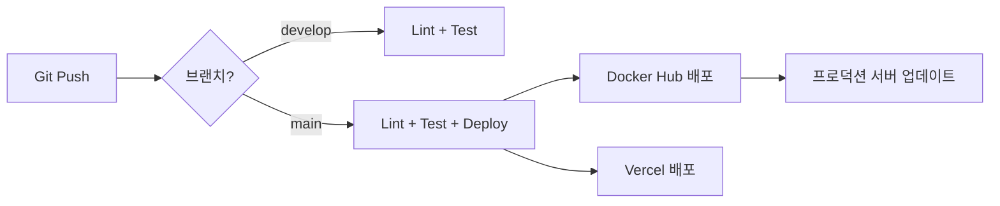

# BAIKAL Shorts Engine - 배포 가이드

> 백엔드(Render) + 프론트엔드(Vercel) 배포 완벽 가이드

## 📋 목차
1. [배포 개요](#배포-개요)
2. [백엔드 배포 (Render)](#백엔드-배포-render)
3. [프론트엔드 배포 (Vercel)](#프론트엔드-배포-vercel)
4. [환경 변수 설정](#환경-변수-설정)
5. [배포 확인 및 테스트](#배포-확인-및-테스트)
6. [트러블슈팅](#트러블슈팅)
7. [GitHub Actions CI/CD](#github-actions-cicd)

---

## 배포 개요

### 아키텍처
- **백엔드**: Render (https://render.com) - 무료 플랜 사용 가능
- **프론트엔드**: Vercel (https://vercel.com) - 무료 플랜 사용 가능
- **데이터베이스**: Supabase (https://supabase.com)

### 배포된 서비스
- 백엔드 API: `https://baikal-shorts-engine.onrender.com`
- 프론트엔드: `https://frontend-sigma-three-25.vercel.app`
- API 문서: `https://baikal-shorts-engine.onrender.com/docs`

---

## 백엔드 배포 (Render)

### 1단계: Render 계정 생성 및 GitHub 연결

1. [Render](https://render.com)에 회원가입
2. Dashboard → **New +** → **Web Service** 선택
3. **Connect GitHub** → 저장소 선택 (`mxten777/baikal-shorts-engine`)

### 2단계: 서비스 설정

```yaml
Name: baikal-shorts-engine
Root Directory: backend
Environment: Python 3
Build Command: pip install -r requirements.txt
Start Command: uvicorn app.main:app --host 0.0.0.0 --port $PORT
```

### 3단계: 환경 변수 설정

Render Dashboard → Environment 탭에서 다음 환경 변수 추가:

```bash
# 필수 환경 변수
SUPABASE_URL=https://your-project-id.supabase.co
SUPABASE_SERVICE_KEY=eyJhbG...  # Supabase service_role key
OPENAI_API_KEY=sk-proj-...
SECRET_KEY=your-secret-key-here

# 선택 사항
YOUTUBE_CLIENT_ID=your-youtube-client-id
YOUTUBE_CLIENT_SECRET=your-youtube-secret
INSTAGRAM_ACCESS_TOKEN=your-instagram-token
SENTRY_DSN=your-sentry-dsn
```

### 4단계: 배포 설정

- **Auto-Deploy**: `On Commit` 선택 (main 브랜치 푸시 시 자동 배포)
- **Branch**: `main`
- **Plan**: Free 선택

### 5단계: 배포 시작

1. **Create Web Service** 클릭
2. 빌드 로그 모니터링 (약 2-5분 소요)
3. 배포 완료 후 서비스 URL 확인

### 6단계: 배포 확인

```bash
# API 헬스체크
curl https://baikal-shorts-engine.onrender.com/

# Swagger UI 확인
# 브라우저에서 https://baikal-shorts-engine.onrender.com/docs 접속
```

---

## 프론트엔드 배포 (Vercel)

### 1단계: Vercel CLI 설치

```bash
npm install -g vercel
```

### 2단계: 프로젝트 연결

```bash
cd frontend
vercel login
vercel link
```

질문에 답변:
- **Set up and deploy**: Y
- **Which scope**: 본인 계정 선택
- **Link to existing project**: N
- **Project name**: frontend (또는 원하는 이름)
- **Directory**: ./ (현재 디렉토리)

### 3단계: 환경 변수 설정

Vercel Dashboard → Settings → Environment Variables에서 추가:

```bash
VITE_API_URL=https://baikal-shorts-engine.onrender.com/api/v1
```

또는 CLI로:
```bash
# Vercel 대시보드에서 직접 추가하는 것을 권장
# (CLI는 특수문자 처리가 까다로움)
```

### 4단계: 프로덕션 배포

```bash
vercel --prod
```

출력 예시:
```
✅  Production: https://frontend-xxx.vercel.app
```

### 5단계: 배포 확인

브라우저에서 프론트엔드 URL 접속하여 확인

---

## 환경 변수 설정

### Supabase 환경 변수

1. [Supabase Dashboard](https://supabase.com/dashboard) 접속
2. 프로젝트 선택 → Settings → API
3. 필요한 값 복사:
   - `SUPABASE_URL`: Project URL
   - `SUPABASE_SERVICE_KEY`: service_role (secret) key ⚠️ **노출 금지**

### OpenAI API Key

1. [OpenAI Platform](https://platform.openai.com/api-keys) 접속
2. **Create new secret key** 클릭
3. 생성된 키를 `OPENAI_API_KEY`로 저장

---

## 배포 확인 및 테스트

### 백엔드 API 테스트

#### 1. 헬스체크
```bash
curl https://baikal-shorts-engine.onrender.com/
```

예상 응답:
```json
{"message": "BAIKAL Shorts Engine API", "version": "0.1.0"}
```

#### 2. Swagger UI
브라우저에서 접속:
```
https://baikal-shorts-engine.onrender.com/docs
```

#### 3. 프로젝트 목록 조회
```bash
curl https://baikal-shorts-engine.onrender.com/api/v1/projects
```

### 프론트엔드 테스트

1. 브라우저에서 Vercel URL 접속
2. 로그인 기능 테스트
3. 프로젝트 생성 테스트
4. 개발자 도구(F12) → Network 탭에서 API 호출 확인

---

## 트러블슈팅

### 🔴 Render 배포 실패

#### 문제 1: `ModuleNotFoundError`
```
ModuleNotFoundError: No module named 'app.config'
```

**원인**: Import 경로 오류

**해결**:
```python
# ❌ 잘못된 코드
from app.config import SUPABASE_URL

# ✅ 올바른 코드
from app.core.config import settings
# 사용: settings.SUPABASE_URL
```

#### 문제 2: `ModuleNotFoundError: No module named 'sentry_sdk'`
**원인**: requirements.txt에 누락

**해결**:
```bash
# backend/requirements.txt에 추가
sentry-sdk[fastapi]>=2.19.0,<3.0.0
```

#### 문제 3: 패키지 버전 충돌
**원인**: 너무 엄격한 버전 제약

**해결**: requirements.txt에서 버전 범위 완화
```txt
# ❌ 엄격한 버전
fastapi==0.115.4

# ✅ 완화된 버전
fastapi>=0.115.0,<0.116.0
```

#### 문제 4: 빌드 타임아웃
**원인**: 무료 플랜의 빌드 시간 제한

**해결**:
- 불필요한 의존성 제거
- Docker 이미지 대신 Native Environment 사용
- 캐시 활용 (Render가 자동으로 처리)

### 🔴 Vercel 배포 실패

#### 문제 1: `npm run build` 실패
```
error TS2339: Property 'env' does not exist on type 'ImportMeta'
```

**원인**: TypeScript 타입 정의 누락

**해결**: `frontend/src/vite-env.d.ts` 파일 생성
```typescript
/// <reference types="vite/client" />

interface ImportMetaEnv {
  readonly VITE_API_URL?: string;
}

interface ImportMeta {
  readonly env: ImportMetaEnv;
}
```

#### 문제 2: API 호출 실패 (CORS 에러)
**원인**: 백엔드 CORS 설정 누락

**해결**: `backend/app/main.py`에서 CORS 설정 확인
```python
from fastapi.middleware.cors import CORSMiddleware

app.add_middleware(
    CORSMiddleware,
    allow_origins=["*"],  # 프로덕션에서는 특정 도메인만 허용
    allow_credentials=True,
    allow_methods=["*"],
    allow_headers=["*"],
)
```

#### 문제 3: 환경 변수 미적용
**원인**: 환경 변수 설정 후 재배포 안 함

**해결**:
```bash
cd frontend
vercel --prod  # 재배포
```

### 🟡 일반적인 문제

#### 문제: Render 무료 인스턴스가 느림
**원인**: 비활성 상태에서 스핀다운 (최대 50초 지연)

**해결**:
- 유료 플랜으로 업그레이드
- 또는 주기적으로 헬스체크 요청 (예: 5분마다)

```bash
# Cron job 예시 (외부 서비스 이용)
*/5 * * * * curl https://baikal-shorts-engine.onrender.com/
```

---

## 로컬 개발 환경 실행

### 백엔드 실행

```bash
cd backend

# 가상환경 활성화 (Windows)
.\venv\Scripts\activate

# 패키지 설치
pip install -r requirements.txt

# .env 파일 생성
cp .env.example .env
# .env 파일 편집 (Supabase, OpenAI 키 입력)

# 서버 실행
uvicorn app.main:app --reload --port 8000
```

### 프론트엔드 실행

```bash
cd frontend

# 패키지 설치
npm install

# 개발 서버 실행
npm run dev
```

- 프론트엔드: http://localhost:5173
- 백엔드 API: http://localhost:8000
- API 문서: http://localhost:8000/docs

---

## GitHub Actions CI/CD

### 워크플로우 개요

#### 1. Backend CI/CD (`.github/workflows/backend.yml`)
- **트리거**: `backend/` 폴더 변경 시
- **단계**:
  - Lint: Black, Flake8, MyPy로 코드 품질 검사
  - Test: Pytest로 단위 테스트 및 커버리지 측정
  - Docker: main 브랜치에 푸시 시 Docker 이미지 빌드 및 배포

#### 2. Frontend CI/CD (`.github/workflows/frontend.yml`)
- **트리거**: `frontend/` 폴더 변경 시
- **단계**:
  - Lint: ESLint로 코드 스타일 검사
  - Build: Vite로 프로덕션 빌드
  - Deploy: Vercel에 자동 배포 (main 브랜치)

### GitHub Secrets 설정

Repository → Settings → Secrets and variables → Actions에서 추가:

```bash
# 백엔드 환경 변수
SUPABASE_URL=https://your-project-id.supabase.co
SUPABASE_SERVICE_KEY=your-service-role-key
OPENAI_API_KEY=sk-your-openai-api-key

# Vercel (자동 배포용)
VERCEL_TOKEN=your-vercel-token
VERCEL_ORG_ID=your-org-id
VERCEL_PROJECT_ID=your-project-id

# Docker Hub (선택)
DOCKER_USERNAME=your-dockerhub-username
DOCKER_PASSWORD=your-dockerhub-token
```

### 로컬에서 CI 테스트

#### 백엔드 Lint & Test
```bash
cd backend

# Formatting 검사
black --check app/

# Lint
flake8 app/ --max-line-length=100

# Type check
mypy app/ --ignore-missing-imports

# Test
pytest tests/ -v --cov=app
```

#### 프론트엔드 Lint & Build
```bash
cd frontend

# Lint
npm run lint

# Build
npm run build
```

---

## 배포 체크리스트

### ✅ 초기 배포

#### 백엔드 (Render)
- [ ] Render 계정 생성
- [ ] GitHub 저장소 연결
- [ ] 환경 변수 설정 (Supabase, OpenAI)
- [ ] Auto-Deploy 활성화
- [ ] 배포 성공 확인
- [ ] API 문서 접속 확인 (`/docs`)

#### 프론트엔드 (Vercel)
- [ ] Vercel CLI 설치
- [ ] Vercel 계정 연결 및 프로젝트 링크
- [ ] 환경 변수 설정 (`VITE_API_URL`)
- [ ] 프로덕션 배포 (`vercel --prod`)
- [ ] 프론트엔드 접속 확인
- [ ] API 연동 테스트

### ✅ 코드 변경 후 배포

#### 백엔드
```bash
# 1. 로컬에서 테스트
cd backend
pytest tests/

# 2. 커밋 및 푸시
git add .
git commit -m "feat: 새 기능 추가"
git push origin main

# 3. Render에서 자동 배포 시작 (약 2-5분)
# 4. 배포 로그 확인: Render Dashboard → Logs
```

#### 프론트엔드
```bash
# 1. 로컬에서 빌드 테스트
cd frontend
npm run build

# 2. 커밋 및 푸시
git add .
git commit -m "feat: UI 개선"
git push origin main

# 3. Vercel 배포
vercel --prod

# 또는 GitHub Actions로 자동 배포 (설정 시)
```

---

## 유용한 명령어 모음

### Render - 로그 확인
```bash
# Render Dashboard에서:
# 서비스 선택 → Logs → 실시간 로그 확인
```

### Vercel - 배포 관리
```bash
# 현재 배포 목록
vercel list

# 환경 변수 목록
vercel env ls

# 환경 변수 추가
vercel env add VITE_API_URL production

# 특정 브랜치 배포
vercel --prod --yes

# 배포 롤백
vercel rollback
```

### Git 워크플로우
```bash
# 현재 상태 확인
git status

# 변경사항 커밋
git add .
git commit -m "type: description"

# 푸시
git push origin main

# 커밋 메시지 규칙:
# - feat: 새 기능
# - fix: 버그 수정
# - docs: 문서 수정
# - style: 코드 포맷팅
# - refactor: 리팩토링
# - test: 테스트 추가
# - chore: 빌드/설정 변경
```

---

## 모니터링 및 유지보수

### 로그 모니터링

#### Render
- Dashboard → 서비스 선택 → Logs
- 실시간 로그 스트리밍 제공
- 에러 발생 시 Slack/Email 알림 설정 가능

#### Vercel
- Dashboard → 프로젝트 선택 → Logs
- Function 실행 로그 확인
- Analytics로 성능 모니터링

### 성능 최적화

#### 백엔드
- Render 무료 플랜: 15분 비활성 시 스핀다운
- 첫 요청 시 50초까지 지연 가능
- 해결: 유료 플랜 또는 주기적 핑

#### 프론트엔드
- Vercel 자동 최적화 (이미지, 코드 스플리팅)
- CDN 엣지 캐싱으로 빠른 응답
- Analytics로 성능 모니터링

### 비용 관리

#### 무료 플랜 제한
- **Render**: 750시간/월, 비활성 시 스핀다운
- **Vercel**: 100GB 대역폭/월, Serverless Functions 100시간/월
- **Supabase**: 500MB 데이터베이스, 1GB 파일 저장소

---

## 다음 단계

### 🎯 프로덕션 준비
- [ ] 커스텀 도메인 연결
- [ ] HTTPS 인증서 설정 (자동)
- [ ] 환경 변수 프로덕션 값으로 변경
- [ ] 에러 트래킹 (Sentry) 설정
- [ ] 로그 수집 및 분석 시스템 구축

### 🚀 고급 기능
- [ ] GitHub Actions로 자동 배포 파이프라인 구축
- [ ] E2E 테스트 자동화
- [ ] 코드 커버리지 측정 및 리포팅
- [ ] Docker Compose로 로컬 개발 환경 구성
- [ ] Kubernetes 배포 (선택)

### 📊 모니터링
- [ ] Uptime 모니터링 (UptimeRobot 등)
- [ ] 성능 모니터링 (Vercel Analytics)
- [ ] 에러 알림 (Sentry, Slack)
- [ ] 사용자 분석 (Google Analytics)

---

## 참고 자료

- [Render 문서](https://render.com/docs)
- [Vercel 문서](https://vercel.com/docs)
- [FastAPI 배포 가이드](https://fastapi.tiangolo.com/deployment/)
- [Vite 프로덕션 빌드](https://vitejs.dev/guide/build.html)
- [Supabase 문서](https://supabase.com/docs)

---

**배포 완료 URL:**
- 🚀 백엔드: https://baikal-shorts-engine.onrender.com
- 🎨 프론트엔드: https://frontend-sigma-three-25.vercel.app
- 📚 API 문서: https://baikal-shorts-engine.onrender.com/docs
```bash
cd backend

# Formatting 검사
black --check app/

# Lint
flake8 app/ --max-line-length=100 --extend-ignore=E203,W503

# Type check
mypy app/ --ignore-missing-imports

# Test
pytest tests/ -v --cov=app
```

### 프론트엔드 Lint & Build
```bash
cd frontend

# Lint
npm run lint

# Type check
npm run type-check

# Build
npm run build
```

### Docker Compose로 전체 스택 실행
```bash
# .env 파일 생성 (backend/.env.example 참고)
cp backend/.env.example backend/.env

# Docker Compose 실행
docker-compose up --build
```

- 프론트엔드: http://localhost:80
- 백엔드 API: http://localhost:8000
- API 문서: http://localhost:8000/docs

---

## 배포 플로우



---

## 트러블슈팅

### 1. GitHub Actions 실패
- **원인**: Secrets 미설정
- **해결**: GitHub Secrets에 필수 환경 변수 추가

### 2. Docker 빌드 실패
- **원인**: requirements.txt 또는 package-lock.json 누락
- **해결**: 의존성 파일 커밋 확인

### 3. Vercel 배포 실패
- **원인**: Vercel Token 만료 또는 프로젝트 연결 끊김
- **해결**: Token 재발급 및 `vercel link` 재실행

---

## 다음 단계

1. ✅ GitHub Secrets 설정
2. ✅ main 브랜치에 푸시하여 CI/CD 파이프라인 테스트
3. ✅ Vercel 또는 Docker로 프로덕션 배포
4. 📊 Codecov 연동 (선택 사항)
5. 🔔 Slack/Discord 알림 연동 (선택 사항)
